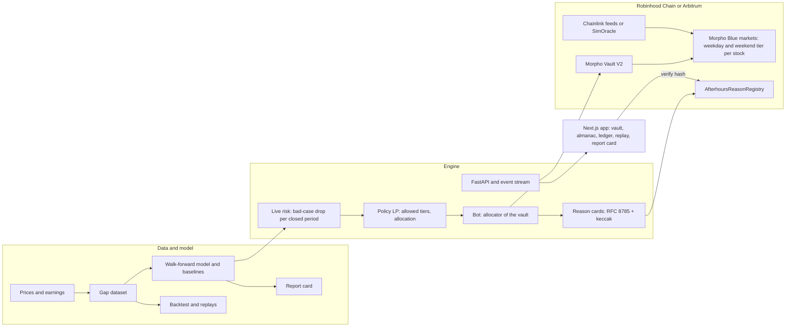

# Afterhours

A lending vault for Robinhood Stock Tokens. It lends USDG at full speed while the stock market
is open and calm, moves lender money to safer Morpho markets before the market closes into risk,
and writes the reason for every move onchain.

Built for the Colosseum Crypto World's Fair, Robinhood Chain track (the same code runs on
Arbitrum). Status and evidence for every step: [PROGRESS.md](PROGRESS.md).

Everything in the running demo is labelled Simulation: it runs on a local chain with simulated
USDG, Stock Tokens and price feeds. Backtests are "historical stock prices, simulated vault".
Every number below comes from a generated file in `artifacts/`; `artifacts/report/numbers.json`
lists them with their sources, and `scripts/check-numbers.py` fails if this README quotes one
that is not there.

## The problem

Stock Tokens trade around the clock on Robinhood Chain. Their Chainlink price feeds follow the
exchange. We read every price update of the 35 Stock Token feeds over 8 weekends (July 31 to
September 18, 2026): 32 feeds posted nothing between Friday 20:00 and Sunday 20:00 New York
time, and the other three (AMD, SGOV, SNDK) posted 5 updates in all, each within 105 seconds
of Friday 20:00 (`artifacts/discovery/oracle_study.json`).

So a lending market priced by those feeds cannot liquidate anyone while the exchange is shut,
and when trading resumes the price can gap. Across 523 US stocks and funds since 2010, 2.1% of
earnings nights opened 10% or more below the previous close; over all 2,032,976 closed periods
it was 0.08% (`artifacts/gaps/summary.json`). A loan at a high loan-to-value limit can reopen
worth less than its debt, and the lenders take the loss.

Lenders face a choice today. Lend in a market with a high limit (more borrowers, higher rates,
exposed to gaps) or a low one (safe, but lower rates all week). Afterhours does both, at the
right times.

## How it works

1. **Two tiers per stock.** Each stock has two Morpho Blue markets: a weekday tier at 91.5%
   LLTV and a weekend tier at 77.0% LLTV. A tier's cushion is how far the price can fall before
   a loan at the limit leaves bad debt: 1 minus LLTV minus Morpho's liquidation incentive
   allowance. That is 6.1% for the weekday tier and 17.3% for the weekend tier.
2. **Forecast the bad case.** Before each close, the engine forecasts every stock's bad-case
   drop for the coming closed periods: the 1% worst gap, from EWMA volatility scaled by the
   hours closed and calibrated per kind of closed period (ordinary night, weekend, holiday,
   earnings night).
3. **Apply one rule.** A tier stays open for a stock only if the bad-case drop plus a 5% safety
   margin fits inside its cushion. A linear program then allocates the vault across the open
   markets for the best yield, within per-stock caps and an idle reserve for withdrawals.
4. **Move before the bell.** The bot, as the allocator of a Morpho Vault V2, moves the money
   that borrowers are not using. Money already lent stays until it is repaid.
5. **Explain every move.** Each reallocation produces a reason card: the forecast, what drove
   it, the rule that fired. Its RFC 8785 canonical hash is written to the
   `AfterhoursReasonRegistry` contract in the same cycle. The web app recomputes the hash in the
   browser and checks it against the onchain event ("Verify on chain").

The interface follows the real exchange clock: a daylit art deco exchange while the market is
open, night after the closing bell, drawn entirely in code.

## Results

**Forecasts.** The LightGBM gap model we built did not beat the simplest baseline on held-out
years, so Afterhours ships the baseline (the report card says so in its first sentence). On
1,229,403 held-out closed periods across 10 walk-forward folds, the real drop was worse than the
forecast bad case 1.30% of the time against a 1% target; on earnings nights 1.08%
(`artifacts/model/report_card.json`).

**Backtest** (historical stock prices, simulated vault): a 2,000,000 USDG vault across NVDA,
SPY, META, SGOV and USO, 2017-01-03 to 2026-09-25, 2,445 closed periods
(`artifacts/backtest/results.json`).

| Strategy | Lender yield | Bad debt (USDG) | Worst single event |
| --- | --- | --- | --- |
| Always weekday tier | 8.84% | 108,748 | 0.74% of the vault |
| Always weekend tier | 6.85% | 7,491 | 0.12% of the vault |
| Afterhours | 7.47% | 5,122 | 0.07% of the vault |
| Perfect foresight (not achievable) | 8.96% | 65,615 | 0.47% of the vault |

Afterhours had about 21 times less bad debt than always lending at the weekday tier, and less
than always staying in the weekend tier while earning more. Its settings were chosen by one
rule: the highest yield among settings whose worst single event loses at most 0.10% of the
vault. Rates, utilisation and borrower behaviour are assumptions; the report card shows how the
results move when they change.

**One night.** META opened 24.5% below its close after earnings on 2022-10-26. Replayed on a
2,000,000 USDG vault, always lending at the weekday tier loses 24,300 USDG; Afterhours loses
2,228 (`artifacts/backtest/replay/META-2022-10-26-earnings.json`).

## Architecture



| Folder | What is there |
| --- | --- |
| `engine/afterhours/` | Python: discovery, data, features, model, risk, policy, backtest, bot, API, simulation |
| `contracts/` | Foundry: reason registry, simulated tokens and oracle, deploy script for Morpho markets and Vault V2 |
| `web/` | Next.js 16, React 19, Tailwind 4, visx, wagmi and RainbowKit, Playwright |
| `config/afterhours.yaml` | Every address source, parameter and URL; nothing is hardcoded (`make lint-hardcode`) |
| `artifacts/` | Generated results: discovery, gap study, model report card, backtest, replays, screenshots, Lighthouse |
| `deployments/` | Deployed and discovered addresses per profile |
| `updates/` | Builder update drafts |

## Run it

From a clean clone, with no `.env` and no keys (everything runs on a local chain, labelled
Simulation):

```bash
make setup     # uv, pnpm and Foundry dependencies; about 5.5 minutes the first time
make demo      # local chain, contracts, seeded borrowers, API, bot, web app, then the closing bell
```

`make demo` fetches daily prices and earnings for the five vault stocks on its first run, deploys
Morpho, the vault and simulated Stock Tokens on Anvil, and runs the closing-bell scenario: the bot
forecasts the coming closed periods, moves money out of the markets whose cushion is too thin,
and anchors a reason for each move in the onchain registry. It took 1 minute 12 seconds on the
clean-clone check (2026-09-26). Open the web app at `http://localhost:$WEB_PORT` (3000 unless
you change it). Ports come from `.env.example`; set `ANVIL_PORT`, `API_PORT` or `WEB_PORT` in
the environment to use others.

`make up` starts the same stack without the scripted scenario. With it running:

```bash
make e2e          # Playwright: the demo flow, every page on desktop and mobile, error states
make lighthouse   # production build, every page
make screens      # screenshots at 1440, 1024 and 390 px
```

Other commands: `make report` regenerates the gap study, model and backtest; `make test`,
`make lint`, `make test-integration`; `make help` lists everything.

## Deployments

| Where | Status |
| --- | --- |
| Local chain (Anvil) | `make demo`; addresses in `deployments/local.json` |
| Robinhood Chain testnet | Rehearsed on a fork of the testnet (`scripts/rehearse-testnet.sh rh-testnet`); live deployment waits on funded testnet keys |
| Arbitrum Sepolia | Rehearsed the same way; live deployment waits on funded testnet keys |
| Robinhood Chain mainnet | Not deployed. Needs an explicit go from the team and an archive RPC for the pinned fork tests |

Neither testnet has Morpho, so testnet profiles deploy Morpho Blue, the adaptive curve IRM and
Vault V2 themselves, with simulated USDG, Stock Tokens and oracles. On mainnet the engine reads
the real Morpho, USDG, Stock Token and Chainlink addresses found in M1 discovery
(`deployments/fork.discovered.json`), each verified onchain.

## Limitations

- **Simulation.** The demo runs on a local chain with simulated tokens and prices. Fork runs at
  a pinned mainnet block need an archive RPC we do not have yet; tests at the chain head pass.
- **The model.** The LightGBM model lost to the EWMA baseline, which ships. The baseline misses
  more often than targeted on holidays (2.74% against 1%).
- **Backtest assumptions.** Supply rates, utilisation, loan turnover and borrower loan-to-value
  are assumptions set in config, not observed markets; sensitivity tables are in the report card.
  The stock universe is today's S&P 500 plus Stock Tokens, so it has survivorship bias.
- **Money already lent cannot move.** Afterhours can only withdraw what borrowers are not using;
  the replay shows the part that stays exposed.
- **Not audited.** The contracts we wrote are small (the registry and simulated tokens), and the
  vault and markets are Morpho's, but nothing here has had a security review.

## Prior work

This repository was started on 2026-09-26, during the hackathon (it opened on 2026-09-14). No
code predates it. It composes with open-source protocols we did not write: Morpho Blue, Morpho
Vault V2, Chainlink and Uniswap interfaces.
