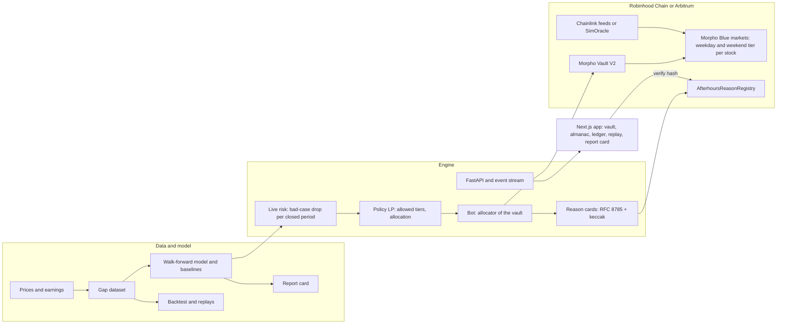

# Afterhours

A lending vault for Robinhood Stock Tokens. It lends USDG to each stock in the riskiest Morpho
market that stock's history allows, pulls back the money borrowers are not using before nights
that could gap past every market's cushion, and writes the reason for every move onchain.

In the held-out backtest (2022-01-03 to 2026-09-24, settings chosen on earlier years only) it
earned 9.12% against 9.09% for the fixed weekday/weekend mix with the nearest yield, with 5,849
USDG of bad debt against 11,132: the same yield as the best fixed mix, with about half the loss.
Historical stock prices, simulated vault.

Built for the Colosseum Crypto World's Fair, Robinhood Chain track (the same code runs on
Arbitrum). Status and evidence for every step: [PROGRESS.md](PROGRESS.md).

Everything in the running demo is labelled Simulation: it runs on a local chain with simulated
USDG, Stock Tokens and price feeds. Backtests are "historical stock prices, simulated vault".
Every number below comes from a generated file in `artifacts/`; `artifacts/report/numbers.json`
lists them with their sources, and `scripts/check-numbers.py` fails if this README quotes one
that is not there.

## The problem

Stock Tokens trade around the clock on Robinhood Chain. Their Chainlink price feeds follow the
exchange. We read every price update of the 35 Stock Token feeds over 8 weekends (July 31 to
September 18, 2026): 32 feeds posted nothing between Friday 20:00 and Sunday 20:00 New York
time, and the other three (AMD, SGOV, SNDK) posted 5 updates in all, each within 105 seconds
of Friday 20:00 (`artifacts/discovery/oracle_study.json`).

So a lending market priced by those feeds cannot liquidate anyone while the exchange is shut,
and when trading resumes the price can gap. Across 523 US stocks and funds since 2010, 2.1% of
earnings nights opened 10% or more below the previous close; over all 2,032,976 closed periods
it was 0.08% (`artifacts/gaps/summary.json`). A loan at a high loan-to-value limit can reopen
worth less than its debt, and the lenders take the loss.

Lenders face a trade-off. Lend in a market with a high limit and earn more while taking the
gaps, or a low one and earn less. Every fixed mix of the two sits on one line; Afterhours sits
above it.

## How it works

1. **Three tiers per stock.** Each stock has three Morpho Blue markets, at 91.5%, 86% and 77%
   LLTV (all three enabled on Robinhood Chain's Morpho). A tier's cushion is how far the price can
   fall before a loan at the limit leaves bad debt: 1 minus LLTV minus Morpho's liquidation
   incentive allowance. That is 6.1%, 10.2% and 17.3%.
2. **A yearly tier map.** Each January every stock is rated on the previous 365 days only: its
   worst 1% closed-period gap. It may lend in the highest tier whose cushion, less 40% of it,
   covers that rating (limits 3.7%, 6.1% and 10.4%), and never below the 77% tier.
3. **A pullback before risky nights.** Before each close, the engine forecasts every stock's
   bad-case drop for the next 5 closed periods: the 1% worst gap, from EWMA volatility scaled by
   the hours closed and calibrated per kind of closed period. If that exceeds every tier's
   cushion less 40% (10.4%), the stock's money that borrowers are not using goes idle. There are
   no nightly moves between tiers.
4. **Move and explain.** The bot, as the allocator of a Morpho Vault V2, places money with a
   linear program within per-stock caps and an idle reserve, and moves only what borrowers are not
   using. Each move produces a reason card (the rating, tonight's forecast, the rule that fired)
   whose RFC 8785 canonical hash goes to the `AfterhoursReasonRegistry` contract. The web app
   recomputes the hash in the browser and checks it onchain ("Verify on chain").

The interface follows the real exchange clock: a daylit art deco exchange while the market is
open, night after the closing bell, drawn entirely in code.

## Results

All results are historical stock prices, simulated vault: a fresh 2,000,000 USDG vault, settings
chosen on 2017 to 2021 only, evaluated on 2022-01-03 to 2026-09-24 (1,186 closed periods).

**How the policy was chosen.** Before running, we wrote down a rule for the design we expected to
ship, which moved each stock between tiers night by night (the dynamic strategy):

> The dynamic strategy wins only if, on 2022 to 2026, it has less bad debt than the no-hindsight fixed map at equal or higher interest.

The result, as recorded:

> The dynamic strategy has less bad debt but less interest in both universes, so under the rule it does not win. Option B applies.

Option B is what Afterhours runs now (above). B was defined after those held-out results were
seen; its settings were then tuned on 2017 to 2021 and evaluated once on the same held-out years,
the second evaluation on that window. Details and every run: `artifacts/backtest/option_a.json`,
`artifacts/backtest/option_b.json`, and [PROGRESS.md](PROGRESS.md).

**The 5 vault stocks** (NVDA, SPY, META, SGOV, USO):

| Strategy | Lender yield | Bad debt (USDG) | Worst single night |
| --- | --- | --- | --- |
| Afterhours (B): yearly tier map plus pullback | 9.12% | 5,849 | 0.107% of the vault |
| Static blend nearest B's yield (90% weekday) | 9.09% | 11,132 | 0.220% |
| No-hindsight fixed map (tiers from the prior year, no pullback) | 9.13% | 8,482 | 0.199% |
| Dynamic strategy (documented alternative) | 8.67% | 748 | 0.020% |
| Always 91.5% | 9.34% | 12,521 | 0.247% |
| Always 77% | 6.88% | 595 | 0.026% |

**All 35 Stock Token underlyings:** B 9.37%, 4,444 USDG, 0.083%; nearest blend (100% weekday)
9.34%, 12,646, 0.244%; fixed map 9.28%, 13,380, 0.244%; dynamic 9.04%, 1,339, 0.025%.

Facts that go with these numbers:
- B against the nearest static blend: yield 9.12% vs 9.09%, bad debt 5,849 vs 11,132 USDG,
  worst single night 0.107% vs 0.220% of the vault.
- B against the fixed map: yield 9.12% vs 9.13%, bad debt 5,849 vs 8,482 USDG, worst single
  night 0.107% vs 0.199%.
- The fixed map broke the 0.10% worst-night cap in tuning (its smallest worst night across all
  settings was 0.543%) and out of sample (0.199%).
- B broke it in tuning too: 0 of 144 settings met it, and the rule's fallback chose the smallest
  worst night (0.541%). Out of sample B's worst night was 0.107% on the 5 vault stocks (above the
  cap) and 0.083% on all 35 (within it).
- The dynamic strategy had the least bad debt (748 USDG) and the smallest worst night (0.020%),
  but earned 963,015 USDG of interest against 1,030,359 for the fixed map, so under the rule it
  did not ship. It remains a documented alternative.
- Tier yields are assumptions, not observed rates: supply APY 9.5%, 8.5% and 7.0% for the 91.5%,
  86% and 77% tiers. How much any strategy gains from the higher tiers depends on that spread.

**One night.** META opened 24.5% below its close after earnings on 2022-10-26. Replayed on a
2,000,000 USDG vault, always lending at 91.5% loses 24,300 USDG; Afterhours (B), which had
pulled META's unborrowed money five nights before, loses 9,953 on the money that was still lent
(`artifacts/backtest/replay/META-2022-10-26-earnings.json`).

**Forecasts.** The LightGBM gap model we built did not beat the simplest baseline on held-out
years, so Afterhours ships the baseline (the report card says so in its first sentence). On
1,229,403 held-out closed periods across 10 walk-forward folds, the real drop was worse than the
forecast bad case 1.30% of the time against a 1% target; on earnings nights 1.08%
(`artifacts/model/report_card.json`).

**The market today.** At Robinhood Chain block 73,382,409 (2026-09-26), 149 Morpho markets used a
Stock Token as collateral; together they held 804,926 USDG supplied and 6,115 USDG borrowed
(`artifacts/discovery/market_size.json`). The market is early.

## Architecture



| Folder | What is there |
| --- | --- |
| `engine/afterhours/` | Python: discovery, data, features, model, risk, policy, backtest, bot, API, simulation |
| `contracts/` | Foundry: reason registry, simulated tokens and oracle, deploy script for Morpho markets and Vault V2 |
| `web/` | Next.js 16, React 19, Tailwind 4, visx, wagmi and RainbowKit, Playwright |
| `config/afterhours.yaml` | Every address source, parameter and URL; nothing is hardcoded (`make lint-hardcode`) |
| `artifacts/` | Generated results: discovery, gap study, model report card, backtest, replays, screenshots, Lighthouse |
| `deployments/` | Deployed and discovered addresses per profile |
| `updates/` | Builder update drafts |

## Run it

From a clean clone, with no `.env` and no keys (everything runs on a local chain, labelled
Simulation):

```bash
make setup     # uv, pnpm and Foundry dependencies; about 5.5 minutes the first time
make demo      # local chain, contracts, seeded borrowers, API, bot, web app, then the closing bell
```

`make demo` fetches daily prices and earnings for the five vault stocks on its first run, deploys
Morpho, the vault and simulated Stock Tokens on Anvil, and replays the week of 2025-04-22: before
META's 2025-04-30 earnings, the bot's forecast bad case for META exceeds every tier's limit, so
it pulls META's unborrowed money and anchors the reason in the onchain registry. It took 1 minute 12 seconds on the
clean-clone check (2026-09-26). Open the web app at `http://localhost:$WEB_PORT` (3000 unless
you change it). Ports come from `.env.example`; set `ANVIL_PORT`, `API_PORT` or `WEB_PORT` in
the environment to use others.

`make up` starts the same stack without the scripted scenario. With it running:

```bash
make e2e          # Playwright: the demo flow, every page on desktop and mobile, error states
make lighthouse   # production build, every page
make screens      # screenshots at 1440, 1024 and 390 px
```

Other commands: `make report` regenerates the gap study, model and backtest; `make test`,
`make lint`, `make test-integration`; `make help` lists everything.

## Deployments

| Where | Status |
| --- | --- |
| Local chain (Anvil) | `make demo`; addresses in `deployments/local.json` |
| Robinhood Chain testnet | Rehearsed on a fork of the testnet (`scripts/rehearse-testnet.sh rh-testnet`); live deployment waits on funded testnet keys |
| Arbitrum Sepolia | Rehearsed the same way; live deployment waits on funded testnet keys |
| Robinhood Chain mainnet | Not deployed. Needs an explicit go from the team and an archive RPC for the pinned fork tests |

Neither testnet has Morpho, so testnet profiles deploy Morpho Blue, the adaptive curve IRM and
Vault V2 themselves, with simulated USDG, Stock Tokens and oracles. On mainnet the engine reads
the real Morpho, USDG, Stock Token and Chainlink addresses found in M1 discovery
(`deployments/fork.discovered.json`), each verified onchain.

## Limitations

- **Simulation.** The demo runs on a local chain with simulated tokens and prices, replaying the
  week of 2025-04-22. Fork runs at a pinned mainnet block need an archive RPC we do not have yet;
  tests at the chain head pass.
- **Two looks at the held-out years.** Option B was defined after option A's held-out results
  were known, so B's held-out figures are a second evaluation on the same window.
- **The worst-night cap.** No setting of B or the fixed map met the 0.10% cap in tuning, which
  includes March 2020. Out of sample B's worst night on the 5 vault stocks was 0.107%.
- **Assumed rates.** Supply rates, utilisation, loan turnover and borrower loan-to-value are
  assumptions set in config, not observed markets. With one assumed rate per tier, the optimiser
  is indifferent between stocks in the same tier, so which stock gets the money within a tier
  comes down to tie-breaks.
- **The model.** The LightGBM model lost to the EWMA baseline, which ships. The baseline misses
  more often than targeted on holidays (2.74% against 1%); most of those misses fall on a few
  market-wide shock dates (PROGRESS.md, item 4).
- **Money already lent cannot move.** Afterhours can only pull what borrowers are not using.
- **Universe.** The stock universe for the gap study is today's S&P 500 plus Stock Tokens, so it
  has survivorship bias.
- **Not audited.** The contracts we wrote are small (the registry and simulated tokens), and the
  vault and markets are Morpho's, but nothing here has had a security review.

## Prior work

This repository was started on 2026-09-26, during the hackathon (it opened on 2026-09-14). No
code predates it. It composes with open-source protocols we did not write: Morpho Blue, Morpho
Vault V2, Chainlink and Uniswap interfaces.
