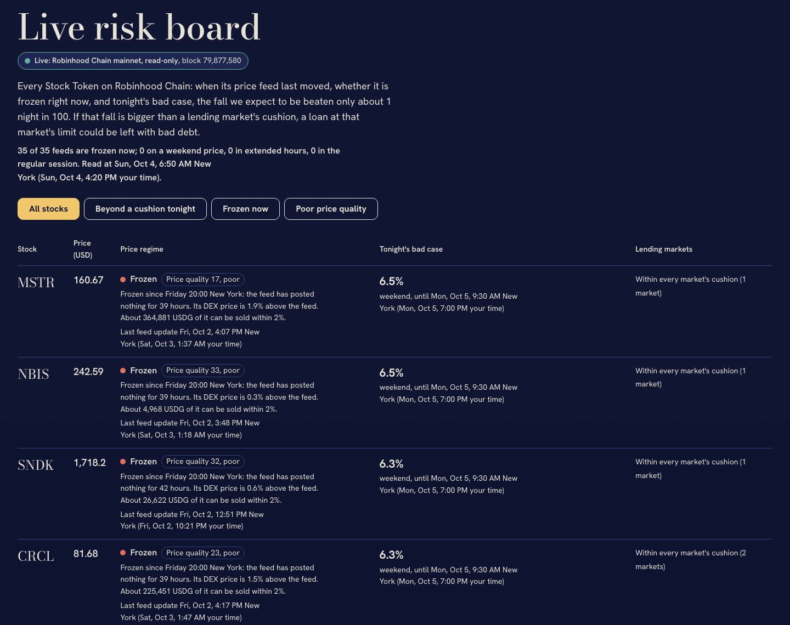
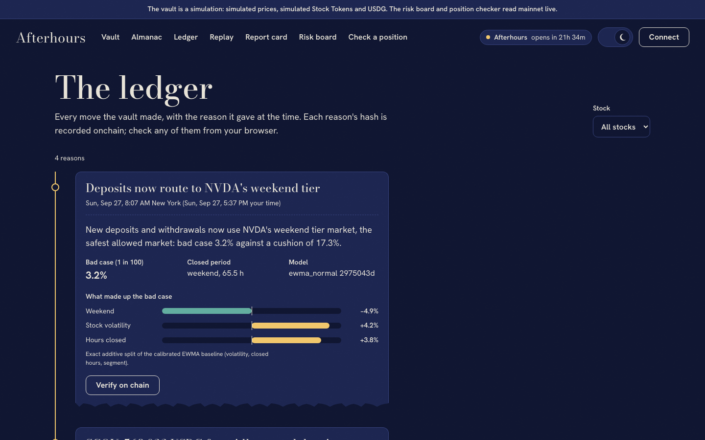
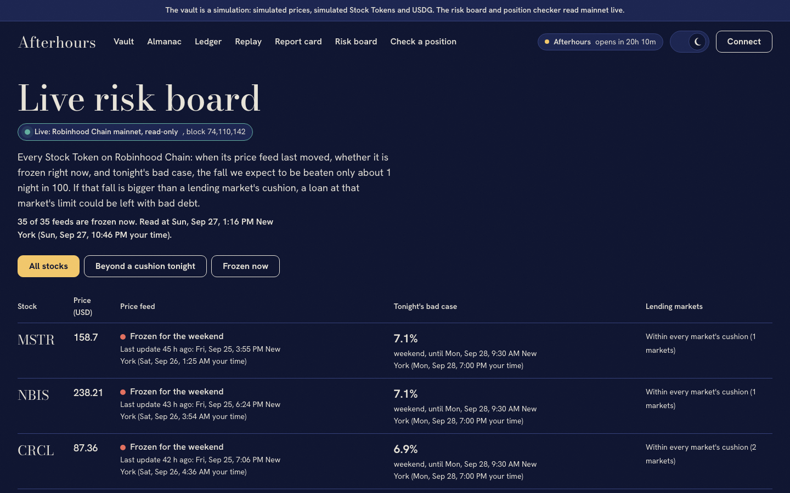
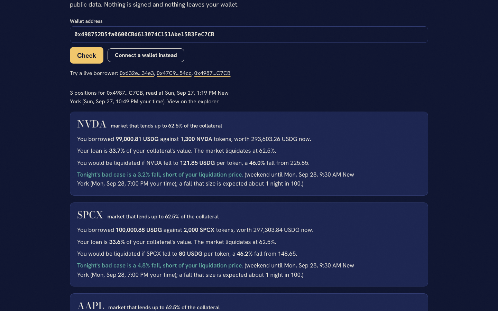
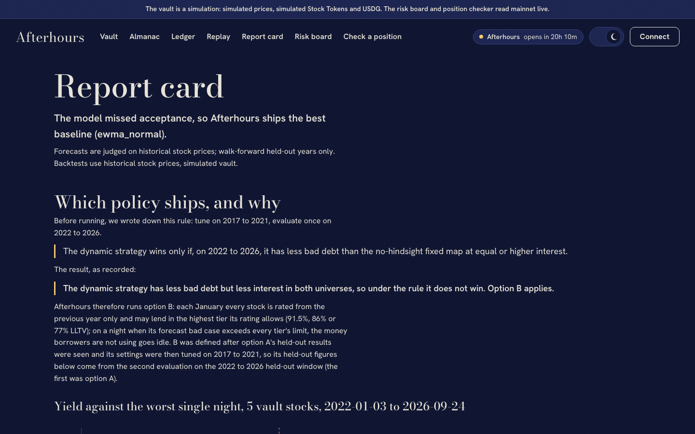
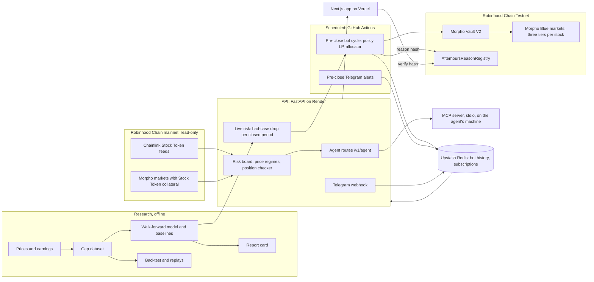

# Afterhours

A risk-curated lending vault for Robinhood Stock Tokens on Morpho, and the read-only risk layer
behind it. The vault lends USDG to each stock in the riskiest market that stock's history allows,
pulls back the money borrowers are not using before nights that could gap past every market's
cushion, and writes the reason for every move onchain. The risk layer tells people and AI agents,
live, which pricing regime every Stock Token is in and how far its price can be trusted.

**[Live app](https://after-hours-web-eta.vercel.app)** ·
**[Risk board](https://after-hours-web-eta.vercel.app/live)** ·
**[For agents](https://after-hours-web-eta.vercel.app/agents)** ·
**[Telegram bot](https://t.me/afterhours_time_bot)** ·
**[API](https://afterhours-api.onrender.com/docs)** ·
**[Testnet vault](https://explorer.testnet.chain.robinhood.com/address/0xD4791630C02FF7462536bAEae7BcE13c5917E6d3)** ·
**[Build log](PROGRESS.md)**


Built for the Colosseum Crypto World's Fair, Robinhood Chain track; the same code runs on
Arbitrum.

## At a glance

| Part | Where it runs | Status |
| --- | --- | --- |
| Lending vault (Morpho Vault V2, three tiers per stock, onchain reason registry) | Robinhood Chain Testnet, simulated tokens | Deployed; bot runs before each US close from GitHub Actions |
| Risk board, price regime monitor, position checker | Robinhood Chain mainnet, read-only | Live on the web app and API |
| Telegram alerts (`/watch NVDA`, `/watch 0x...`) | [@afterhours_time_bot](https://t.me/afterhours_time_bot) | Live, messages before a risky close |
| Weekend risk for AI agents (MCP server and REST) | Your machine (MCP, stdio) calling the hosted API | Live; install in one config block |
| Backtest, replays, report card | Historical stock prices, simulated vault | Published with every run in `artifacts/` |

> **What is real and what is simulated.** The vault runs on Robinhood Chain Testnet with
> simulated USDG, Stock Tokens and price feeds, and the app labels it Simulation. The risk board
> and position checker read Robinhood Chain mainnet live, read-only. Backtests are "historical
> stock prices, simulated vault". Every number in this README comes from a generated file in
> `artifacts/`; `artifacts/report/numbers.json` lists each with its source, and
> `scripts/check-numbers.py` fails if this file quotes one that is not there.

## Contents

- [At a glance](#at-a-glance)
- [Frozen today, thin tomorrow](#frozen-today-thin-tomorrow)
- [Results in brief](#results-in-brief)
- [The problem](#the-problem)
- [How it works](#how-it-works)
- [What you can use today](#what-you-can-use-today)
- [For AI agents](#for-ai-agents)
- [Results](#results)
- [Architecture](#architecture)
- [Run it locally](#run-it-locally)
- [Deployments](#deployments)
- [Testing and checks](#testing-and-checks)
- [Limitations](#limitations)
- [Future work](#future-work)
- [Prior work](#prior-work)
- [License](#license)

## Frozen today, thin tomorrow

**Frozen today.** Stock Token price feeds on Robinhood Chain post nothing from Friday 20:00 to
Sunday 20:00 New York time. Over the 8 weekends of our first reading, 32 of 35 feeds posted
nothing in that window (the other three only closing prints within 105 seconds of it opening).
We have kept reading, never rewriting the first reading: 9 weekends so far, and in the latest
(from 2026-09-25) 34 of 35 posted nothing, SGOV once right after the window opened
(`artifacts/discovery/oracle_readings/`). No Stock Token feed follows a weekend market yet.

**Thin tomorrow.** On 2026-09-29 Robinhood announced weekend trading of a curated list of US
stocks and ETFs through Bruce ATS, "coming soon, pending regulatory review", and AI trading agents
whose Loops can run a strategy around the clock ([sources and exact wording](docs/findings/robinhood-2026-09-29.md)).
If the feeds start following a weekend venue, the risk moves from "no price" to "thin price": a
weekend price from one venue can gap and be pushed around while the regular market is shut.

**So Afterhours knows which regime each Stock Token is in, hour by hour.** The
[price regime monitor](docs/REGIME.md) classifies every token as regular session, extended hours,
weekend price or frozen, from the exchange calendar, its feed's cadence measured from the study,
and its DEX price and depth against the feed, and gives each a price quality score with a
documented formula. On Saturday 2026-10-04 (block 79,868,354) all 35 were frozen, the median DEX
price sat 0.36% from its frozen feed, and IONQ and RGTI had drifted 3.4% and 7.3%, past the
divergence trigger (`artifacts/regime/`). People see it on the landing page and the risk board;
agents get it through four read-only [MCP tools](#for-ai-agents).



## Results in brief

In the held-out backtest (2022-01-03 to 2026-09-24, settings chosen on earlier years only),
Afterhours earned 9.12% against 9.09% for the fixed weekday/weekend mix with the nearest yield,
with 5,849 USDG of bad debt against 11,132: the same yield as the best fixed mix, with about half
the loss. These are historical stock prices, a simulated vault and modelled rates: real Stock
Token markets on Morpho paid lenders 0.0016% at block 73,650,323.

## The problem

Stock Tokens trade around the clock on Robinhood Chain. Their Chainlink price feeds follow the
exchange. We read every price update of the 35 Stock Token feeds over 8 weekends (July 31 to
September 18, 2026): 32 feeds posted nothing between Friday 20:00 and Sunday 20:00 New York
time, and the other three (AMD, SGOV, SNDK) posted 5 updates in all, each within 105 seconds
of Friday 20:00 (`artifacts/discovery/oracle_study.json`).

So a lending market priced by those feeds cannot liquidate anyone while the exchange is shut,
and when trading resumes the price can gap. Across 523 US stocks and funds since 2010, 2.1% of
earnings nights opened 10% or more below the previous close; over all 2,032,976 closed periods
it was 0.08% (`artifacts/gaps/summary.json`). A loan at a high loan-to-value limit can reopen
worth less than its debt, and the lenders take the loss.

Lenders face a trade-off: lend in a market with a high limit and earn more while taking the
gaps, or in a low one and earn less. Every fixed mix of the two sits on one line; Afterhours
sits above it.

## How it works

1. **Three tiers per stock.** Each stock has three Morpho Blue markets, at 91.5%, 86% and 77%
   LLTV (all three enabled on Robinhood Chain's Morpho). A tier's cushion is how far the price can
   fall before a loan at the limit leaves bad debt: 1 minus LLTV minus Morpho's liquidation
   incentive allowance. That is 6.1%, 10.2% and 17.3%.
2. **A yearly tier map.** Each January every stock is rated on the previous 365 days only: its
   worst 1% closed-period gap. It may lend in the highest tier whose cushion, less 40% of it,
   covers that rating (limits 3.7%, 6.1% and 10.4%), and never below the 77% tier.
3. **A pullback before risky nights.** Before each close, the engine forecasts every stock's
   bad-case drop for the next 5 closed periods: the 1% worst gap, from EWMA volatility scaled by
   the hours closed and calibrated per kind of closed period. If that exceeds every tier's
   cushion less 40% (10.4%), the stock's money that borrowers are not using goes idle. There are
   no nightly moves between tiers.
4. **Move and explain.** The bot, as the allocator of a Morpho Vault V2, places money with a
   linear program within per-stock caps and an idle reserve, and moves only what borrowers are not
   using. Each move produces a reason card (the rating, tonight's forecast, the rule that fired)
   whose RFC 8785 canonical hash goes to the `AfterhoursReasonRegistry` contract. The web app
   recomputes the hash in the browser and checks it onchain ("Verify on chain").

The interface follows the real exchange clock: a daylit art deco exchange while the market is
open, night after the closing bell, drawn entirely in code.



## What you can use today

All of these are live at [after-hours-web-eta.vercel.app](https://after-hours-web-eta.vercel.app).

| Page | What it shows | Data |
| --- | --- | --- |
| Landing | The exchange clock, and "Frozen today, thin tomorrow": live counts per price regime and the least trustworthy prices | Robinhood Chain mainnet, read-only |
| Vault | The vault's allocation across stocks and tiers, deposit and withdraw | Robinhood Chain Testnet, simulated tokens |
| Ledger | Every move the vault made with its reason card; "Verify on chain" recomputes the hash and checks the registry | Testnet registry |
| Almanac | Each stock's forecast bad case for the closed periods ahead | Historical prices, live model |
| Replay | Past nights replayed on a simulated vault, such as META's 2022 earnings gap | Historical stock prices, simulated vault |
| Report card | How the policy and the forecasting model were chosen and judged | Generated artifacts |
| Risk board | Every Stock Token: its price regime, price quality score and a plain line, when its feed last moved, and tonight's bad case against each lending market's cushion | Robinhood Chain mainnet, read-only |
| Check a position | Any address's Morpho loans against Stock Tokens: loan-to-value, liquidation price, and whether tonight's bad case reaches it | Robinhood Chain mainnet, read-only |
| Agents | How to connect Claude Desktop or any MCP client in under a minute, and a real captured session | The hosted API |





Session and forecast times show in New York time and in the visitor's own time zone. Wallets
connect through RainbowKit (browser wallets and WalletConnect); nothing on mainnet is ever
signed.

**Telegram alerts.** Message [@afterhours_time_bot](https://t.me/afterhours_time_bot): `/watch NVDA`
follows a stock, `/watch 0x...` follows a wallet's Stock Token loans, `/list`, `/unwatch` and
`/stop` manage them. Before each close, inside the pre-close window, it messages only when
tonight's bad case reaches a market's cushion (a stock) or a loan's liquidation price (a wallet).
Commands arrive through a webhook on the API; the checks run in GitHub Actions. Running your own
copy: [docs/HOSTING.md](docs/HOSTING.md), steps 2 and 7.

## For AI agents

Robinhood's agents are meant to act overnight, while their owners sleep; they need risk they can
read. Afterhours serves it two ways, both read-only ([docs/AGENTS.md](docs/AGENTS.md)):

| MCP tool | REST | Answers |
| --- | --- | --- |
| `market_status()` | `GET /v1/agent/market-status` | Exchange open or shut, next open and close, where feeds stand, tokens per price regime |
| `get_weekend_risk(ticker)` | `GET /v1/agent/weekend-risk/{ticker}` | Regime, price quality, next closed period, bad-case drop, which market cushions it passes, a plain paragraph |
| `check_position(address)` | `GET /v1/agent/positions/{address}` | Every Stock Token Morpho loan of a wallet against tonight's bad case |
| `explain_move(reason_id)` | `GET /v1/agent/moves/{reason_id}` | A vault reason card and its onchain verification |

The MCP server is the small [`agents/`](agents/README.md) package (official MCP Python SDK, stdio,
no key, no write path). Add it to Claude Desktop:

```json
{
  "mcpServers": {
    "afterhours": {
      "command": "uvx",
      "args": ["--from", "git+https://github.com/bytes06runner/AfterHours#subdirectory=agents", "afterhours-mcp"],
      "env": { "AFTERHOURS_API_URL": "https://afterhours-api.onrender.com" }
    }
  }
}
```

The REST routes have an OpenAPI schema at `/openapi.json` and a per-client rate limit. A real
session, captured through exactly this install, is on the [Agents page](https://after-hours-web-eta.vercel.app/agents)
(`artifacts/agents/example-session.json`).

## Results

All results are historical stock prices, simulated vault: a fresh 2,000,000 USDG vault, settings
chosen on 2017 to 2021 only, evaluated on 2022-01-03 to 2026-09-24 (1,186 closed periods).

**Yields here use modelled rates.** The backtest assumes supply APYs of 9.5%, 8.5% and 7.0% for
the 91.5%, 86% and 77% tiers. Real Stock Token markets on Morpho paid lenders 0.0016% at block
73,650,323 (see "The market today" below). The comparisons between strategies hold under the
same assumed rates; the yield levels do not describe today's market.

**How the policy was chosen.** Before running, we wrote down a rule for the design we expected to
ship, which moved each stock between tiers night by night (the dynamic strategy):

> The dynamic strategy wins only if, on 2022 to 2026, it has less bad debt than the no-hindsight fixed map at equal or higher interest.

The result, as recorded:

> The dynamic strategy has less bad debt but less interest in both universes, so under the rule it does not win. Option B applies.

Option B is what Afterhours runs now (above). B was defined after those held-out results were
seen; its settings were then tuned on 2017 to 2021 and evaluated once on the same held-out years,
the second evaluation on that window. Details and every run: `artifacts/backtest/option_a.json`,
`artifacts/backtest/option_b.json`, and [PROGRESS.md](PROGRESS.md).



**The 5 vault stocks** (NVDA, SPY, META, SGOV, USO):

| Strategy | Lender yield | Bad debt (USDG) | Worst single night |
| --- | --- | --- | --- |
| Afterhours (B): yearly tier map plus pullback | 9.12% | 5,849 | 0.107% of the vault |
| Static blend nearest B's yield (90% weekday) | 9.09% | 11,132 | 0.220% |
| No-hindsight fixed map (tiers from the prior year, no pullback) | 9.13% | 8,482 | 0.199% |
| Dynamic strategy (documented alternative) | 8.67% | 748 | 0.020% |
| Always 91.5% | 9.34% | 12,521 | 0.247% |
| Always 77% | 6.88% | 595 | 0.026% |

**All 35 Stock Token underlyings:** B 9.37%, 4,444 USDG, 0.083%; nearest blend (100% weekday)
9.34%, 12,646, 0.244%; fixed map 9.28%, 13,380, 0.244%; dynamic 9.04%, 1,339, 0.025%.

What goes with these numbers:
- B against the nearest static blend: yield 9.12% vs 9.09%, bad debt 5,849 vs 11,132 USDG,
  worst single night 0.107% vs 0.220% of the vault.
- B against the fixed map: yield 9.12% vs 9.13%, bad debt 5,849 vs 8,482 USDG, worst single
  night 0.107% vs 0.199%.
- The fixed map broke the 0.10% worst-night cap in tuning (its smallest worst night across all
  settings was 0.543%) and out of sample (0.199%).
- B broke it in tuning too: 0 of 144 settings met it, and the rule's fallback chose the smallest
  worst night (0.541%). Out of sample B's worst night was 0.107% on the 5 vault stocks (above the
  cap) and 0.083% on all 35 (within it).
- The dynamic strategy had the least bad debt (748 USDG) and the smallest worst night (0.020%),
  but earned 963,015 USDG of interest against 1,030,359 for the fixed map, so under the rule it
  did not ship. It remains a documented alternative.
- How often B acted: on the 5 vault stocks it pulled unborrowed money on 228 nights from 2022 to
  2026-09-24 (83, 35, 40, 40 and 30 by year), 10,241,622 USDG in all, counting each pull (money
  returns when the forecast allows, so it is pulled again). It was almost always META or NVDA
  (`artifacts/backtest/option_b_activity.json`).
- Tier yields are assumptions, not observed rates: supply APY 9.5%, 8.5% and 7.0% for the 91.5%,
  86% and 77% tiers. How much any strategy gains from the higher tiers depends on that spread.

**One night.** META opened 24.5% below its close after earnings on 2022-10-26. Replayed on a
2,000,000 USDG vault, always lending at 91.5% loses 24,300 USDG; Afterhours (B), which had
pulled META's unborrowed money five nights before, loses 9,953 on the money that was still lent
(`artifacts/backtest/replay/META-2022-10-26-earnings.json`).

**Forecasts.** The LightGBM gap model we built did not beat the simplest baseline on held-out
years, so Afterhours ships the baseline (the report card says so in its first sentence). On
1,229,403 held-out closed periods across 10 walk-forward folds, the real drop was worse than the
forecast bad case 1.30% of the time against a 1% target; on earnings nights 1.08%
(`artifacts/model/report_card.json`).

**The market today.** At Robinhood Chain block 73,650,323 (2026-09-27), 150 Morpho markets used a
Stock Token as collateral; the 148 lending USDG held 804,926 USDG supplied and 6,182 borrowed, a
utilization of 0.77%. Borrowing happened in 31 of them. Lenders there earned a supply APY of
0.0016% (supply-weighted) and borrowers paid 0.20% (`artifacts/discovery/market_size.json`,
read with each market's interest rate model at that block). The market is early.

## Architecture



| Folder | What is there |
| --- | --- |
| `engine/afterhours/` | Python: discovery, data, features, model, risk, policy, backtest, bot, API, live mainnet views and price regimes, agent routes, Telegram alerts, simulation |
| `agents/` | The MCP server (`afterhours-mcp`): four read-only tools over the agent routes |
| `contracts/` | Foundry: reason registry, simulated tokens and oracle, deploy script for Morpho markets and Vault V2 |
| `web/` | Next.js 16, React 19, Tailwind 4, visx, wagmi and RainbowKit, Playwright |
| `config/afterhours.yaml` | Every address source, parameter and URL; nothing is hardcoded (`make lint-hardcode`) |
| `artifacts/` | Generated results: discovery, gap study, model report card, backtest, replays, screenshots, Lighthouse |
| `deployments/` | Deployed and discovered addresses per profile |
| `docs/` | [Price regimes](docs/REGIME.md), [agents](docs/AGENTS.md), [hosting](docs/HOSTING.md), findings, [pitch](docs/video/pitch.md) and [demo](docs/video/demo.md) scripts, the animated pitch and screen demo projects |
| `.github/workflows/` | The scheduled pre-close jobs |

## Run it locally

From a clean clone, with no `.env` and no keys (everything runs on a local chain, labelled
Simulation):

```bash
make setup     # uv, pnpm and Foundry dependencies; about 5.5 minutes the first time
make demo      # local chain, contracts, seeded borrowers, API, bot, web app, then the closing bell
```

`make demo` fetches daily prices and earnings for every Stock Token on its first run, deploys
Morpho, the vault and simulated Stock Tokens on Anvil, and replays the week of 2025-04-22: before
META's 2025-04-30 earnings, the bot's forecast bad case for META exceeds every tier's limit, so
it pulls META's unborrowed money and anchors the reason in the onchain registry. It took 1 minute
22 seconds on the clean-clone check (2026-09-27). Open the web app at `http://localhost:$WEB_PORT`
(3000 unless you change it). Ports come from `.env.example`; set `ANVIL_PORT`, `API_PORT` or
`WEB_PORT` in the environment to use others.

`make up` starts the same stack without the scripted scenario. Other commands:

| Command | What it does |
| --- | --- |
| `make report` | Regenerates the gap study, model and backtest |
| `make alerts` | Runs the Telegram bot locally by long polling (needs `TELEGRAM_BOT_TOKEN` in `.env`) |
| `make testnet-keys` | Writes four throwaway testnet keys into `.env`, printing addresses only |
| `make fund-allocator PROFILE=rh-testnet` | Sends the allocator its testnet gas from the deployer, after asking |
| `make help` | Lists everything |

## Deployments

| Where | Status |
| --- | --- |
| Web app and API | [after-hours-web-eta.vercel.app](https://after-hours-web-eta.vercel.app) (Vercel) and [afterhours-api.onrender.com](https://afterhours-api.onrender.com/v1/health) (Render), free tiers; set up with [docs/HOSTING.md](docs/HOSTING.md) |
| Scheduled jobs | GitHub Actions, `Pre-close jobs`: the bot's pre-close cycle on the testnet vault and the Telegram pre-close alerts, hourly on weekdays |
| Telegram bot | [@afterhours_time_bot](https://t.me/afterhours_time_bot), webhook on the API, subscriptions in Upstash Redis |
| Robinhood Chain testnet | Deployed 2026-09-27 (`deployments/rh-testnet.json`), simulated USDG, collateral and oracles: vault [`0xD4791630C02FF7462536bAEae7BcE13c5917E6d3`](https://explorer.testnet.chain.robinhood.com/address/0xD4791630C02FF7462536bAEae7BcE13c5917E6d3), reason registry [`0x2416C56ea86895cf2dE81eBe0Da1f742bDb30ee0`](https://explorer.testnet.chain.robinhood.com/address/0x2416C56ea86895cf2dE81eBe0Da1f742bDb30ee0) |
| Arbitrum Sepolia | Rehearsed on a fork of the testnet (`scripts/rehearse-testnet.sh arb-sepolia`); not deployed yet |
| Local chain (Anvil) | `make demo`; addresses in `deployments/local.json` |
| Robinhood Chain mainnet | Not deployed. Needs an explicit go from the team and an archive RPC for the pinned fork tests |

Neither testnet has Morpho, so testnet profiles deploy Morpho Blue, the adaptive curve IRM and
Vault V2 themselves, with simulated USDG, Stock Tokens and oracles. On mainnet the engine reads
the real Morpho, USDG, Stock Token and Chainlink addresses found in M1 discovery
(`deployments/fork.discovered.json`), each verified onchain.

## Testing and checks

```bash
make test         # Python, web and Solidity tests, config round trip, integration
make lint         # ruff, mypy, eslint, prettier, forge fmt, plus the two checks below
make e2e          # Playwright against a running stack: every page on desktop and mobile, the demo flow, error states
make lighthouse   # production build, every page
```

- Python tests cover the engine and the MCP server (`engine/tests`, `agents/tests`), including
  the read-only tool hints, a real stdio session, the rate limit, the regime classifier on
  calendar edges such as Thanksgiving, and memory guards that keep heavy modules out of the
  hosted API.
- `make lint-hardcode` fails on any address, URL or protocol parameter outside `config/` and
  `deployments/`.
- `make lint-numbers` fails if this README or the pitch quotes a number that is not in
  `artifacts/report/numbers.json`.
- `scripts/rehearse-testnet.sh <profile>` deploys, seeds and runs a bot cycle on a fork of a
  testnet with throwaway keys before any real testnet deploy.

## Limitations

- **Simulation.** The vault uses simulated tokens and prices on testnet, and the local demo
  replays the week of 2025-04-22. Fork runs at a pinned mainnet block need an archive RPC we do
  not have yet; tests at the chain head pass.
- **Two looks at the held-out years.** Option B was defined after option A's held-out results
  were known, so B's held-out figures are a second evaluation on the same window.
- **The worst-night cap.** No setting of B or the fixed map met the 0.10% cap in tuning, which
  includes March 2020. Out of sample B's worst night on the 5 vault stocks was 0.107%.
- **Assumed rates.** Supply rates, utilisation, loan turnover and borrower loan-to-value are
  assumptions set in config, not observed markets. With one assumed rate per tier, the optimiser
  is indifferent between stocks in the same tier, so which stock gets the money within a tier
  comes down to tie-breaks.
- **The model.** The LightGBM model lost to the EWMA baseline, which ships. The baseline misses
  more often than targeted on holidays (2.74% against 1%); most of those misses fall on a few
  market-wide shock dates (PROGRESS.md, item 4).
- **Money already lent cannot move.** Afterhours can only pull what borrowers are not using.
- **Universe.** The stock universe for the gap study is today's S&P 500 plus Stock Tokens, so it
  has survivorship bias.
- **Free hosting.** The API runs on a free instance (512 MB) that sleeps without traffic, so a
  first request after a sleep can take about a minute, and the live mainnet views use RPCs that
  can rate-limit. Saved boards and scan state let a restarted instance answer at once; details in
  [docs/HOSTING.md](docs/HOSTING.md).
- **Price regimes.** No weekend price source has appeared yet, so the weekend price regime has
  never been observed live; it is tested with stubs. DEX prices and depth use the two deepest USDG
  pools per token and take USDG as 1 USD, as in discovery. The bad-case forecast is not adjusted
  for the regime: there is no weekend-venue history to calibrate an adjustment on.
- **Agents.** The MCP server runs on the agent's machine over stdio and calls the hosted API; it
  is not served from the API host, which has no memory to spare on the free plan. It reads only.
- **Not audited.** The contracts we wrote are small (the registry and simulated tokens), and the
  vault and markets are Morpho's, but nothing here has had a security review.

## Future work

- Use the real testnet Stock Tokens the Robinhood Chain faucet hands out (TSLA, AMZN, PLTR, NFLX, AMD) as testnet collateral instead of simulated ones.
- Once a Stock Token feed follows a weekend venue, measure how weekend prices behave and decide,
  on that data, whether the bad-case forecast should change in the weekend price regime.
- Serve the MCP server over streamable HTTP from a host with memory to spare.
- Deploy the testnet vault on Arbitrum Sepolia too (rehearsed, not deployed), then a security
  review before any mainnet vault.

## Prior work

This repository was started on 2026-09-26, during the hackathon (it opened on 2026-09-14). No
code predates it. It composes with open-source protocols we did not write: Morpho Blue, Morpho
Vault V2, Chainlink and Uniswap interfaces.

## License

[MIT](LICENSE). Morpho, Chainlink and the other protocols this composes with keep their own
licenses.
